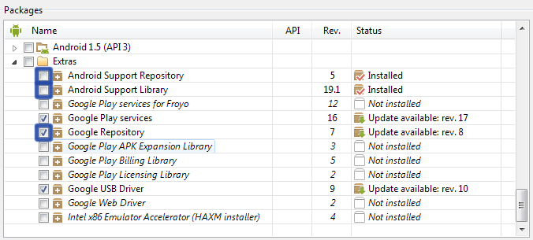
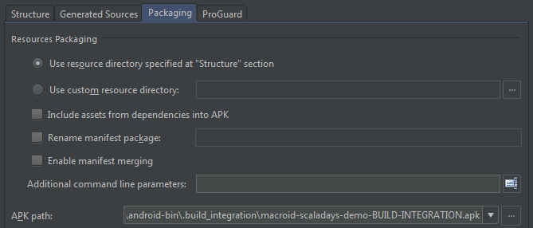

# Scala on Android

Writing your Android project in [Scala](http://scala-lang.org/) is becoming smoother and smoother.
This is a short guide that will help you get started.

## Pros/cons

* (+) Concise code
* (+) Fantastic concurrency support (futures/promises, scala-async, actors, ...)
* (+) Advanced DSLs (like Macroid ;) )
* (−) Build time (due to ProGuard + dex taking up to 1 minute on big projects)

## Tutorials

If the instructions below are too dry for your taste, check out these tutorials:

* [Android & Scala (part 1)](http://blog.eigengo.com/2014/06/21/android-and-scala/) by [Jan Macháček](https://twitter.com/honzam399)

## The Android SDK

The SDK can be downloaded from the [Android website](http://developer.android.com/sdk/index.html).
You will also need to configure `ANDROID_SDK_HOME` environment variable to point to the installation.

To use the bundled libraries, such as the support library, make sure you install the following items in the SDK manager:

## The build system

The most important part of the equation is the build system
(in mainland Android you are likely to use one anyway).
After configuring the build you will be able to compile and *run the project from the command line*
and *generate IDE project files automatically*.

Currently there are three options:

* **Recommended**. Use [sbt](http://www.scala-sbt.org/), Scala’s de-facto standard build system.
  You’ll have to install it from its website. To compile and run Android projects you’ll need the
  [Android plugin](https://github.com/pfn/android-sdk-plugin). Follow the plugin’s readme page to set things up.

* Use [Gradle](http://www.gradle.org/) and [Android+Scala plugin](https://github.com/saturday06/gradle-android-scala-plugin), which — according to its page — is not stable yet.

* **Not recommended**. Just use an IDE without the build system.
  For Eclipse you’ll need the [ADT plugin](http://developer.android.com/tools/sdk/eclipse-adt.html), [Scala IDE](http://scala-ide.org/) and [AndroidProguardScala plugin](https://github.com/banshee/AndroidProguardScala).
  For [Intellij IDEA](http://www.jetbrains.com/idea/) or [Android Studio](http://developer.android.com/sdk/installing/studio.html), which is the same, see [this guide](https://github.com/yareally/android-scala-intellij-no-sbt-plugin).

## The IDE

The recommended IDE is [Intellij IDEA](http://www.jetbrains.com/idea/) or
[Android Studio](http://developer.android.com/sdk/installing/studio.html), which is the same.
You will need to have the [Scala](http://plugins.jetbrains.com/plugin/?id=1347)
and [sbt](http://plugins.jetbrains.com/plugin/5007?pr=idea) plugins installed. Below I am assuming that
you are using the first building option, i.e. sbt.

Once you have the build running from the command line, follow the instructions for the sbt plugin to
create IDE project files.

Inside IDEA, you can use the sbt console to run the project. Alternatively, the “run” button could
be reconfigured for that purpose: go to Run → Edit Configurations →
(select a configuration) → Before launch. You need to configure it to look like this:

Make sure that the paths to `AndroidManifest.xml` and the `APK`
are configured properly. Go to Project settings → Modules → (select main module) → Android → Structure/Packaging.
* Manifest file should be `/path-to-project/src/main/AndroidManifest.xml`:
  
* APK path should be `path-to-project/target/android-bin/build_integration/{module name}-BUILD-INTEGRATION.apk`:
  

## Additional steps

It is possible to preload Scala standard library on the emulator to reduce build times.
Here is [a tool](https://github.com/svenwiegand/scala-libs-for-android-emulator) to do that.

## Useful resources

* When in doubt, don’t hesitate to use the [Scala-on-Android mailing list](https://groups.google.com/forum/#!forum/scala-on-android).
* See the [talks](Talks.html) section, as I also cover the matter in those talks.